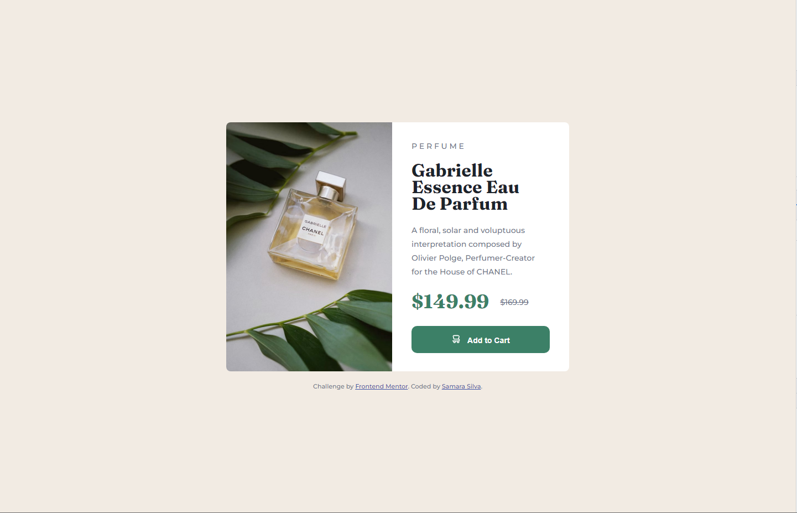
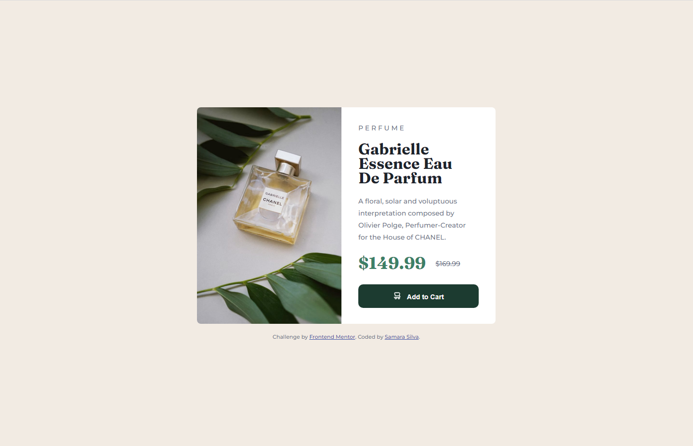

# Frontend Mentor - Product preview card component solution

This is a solution to the [Product preview card component challenge on Frontend Mentor](https://www.frontendmentor.io/challenges/product-preview-card-component-GO7UmttRfa). Frontend Mentor challenges help you improve your coding skills by building realistic projects. 

## Table of contents

- [Overview](#overview)
  - [The challenge](#the-challenge)
  - [Screenshot](#screenshot)
  - [Links](#links)
- [My process](#my-process)
  - [Built with](#built-with)
  - [What I learned](#what-i-learned)
  - [Continued development](#continued-development)
  - [Useful resources](#useful-resources)
- [Author](#author)

## Overview

In this README I go over my process of development for this challenge, the things I learned and the tools I used trying to get my page as close to the design as possible.

### The challenge

Users should be able to:

- View the optimal layout depending on their device's screen size
- See hover and focus states for interactive elements

### Screenshot





### Links

- Solution URL: [Solution](https://www.frontendmentor.io/solutions/responsive-solution-using-css-grid-and-flexbox-beS9954X7j)
- Live Site URL: [Site](https://samarasilva18.github.io/product-preview-card-component/)

## My process

1. I went with a Mobile-First workflow again this time, and once again it proved to be a faster and easier approach to building a component! I used a flexbox with flex-direction column to focus on making it look nice on mobile first.
2. Then I structured the HTML divs, paragraphs, spans, and so on.
3. Then I stylized the page from top down. First the body and the main component, then the image, the title, the paragraphs, and the button.
4. I made the active :hover state on the button.
5. I used the @media functionality to create the alternate CSS for desktop users. I used a CSS Grid for the first time!
6. I wrote the README.
7. I created the repository in Github and uploaded the project.

### Built with

- CSS custom properties
- Flexbox
- CSS Grid
- Mobile-first workflow

### What I learned

I used a CSS grid for the first time in this project. I don't think I fully get it just yet, but I think it looks okay and I enjoyed trying something more challenging than flexbox this time!

```css
main {
  display: inline-grid;
}

main .container {
  grid-column-start: 2;
  grid-column-end: 2;
}
```

### Continued development

I definitely want to train my use of CSS Grids more. I don't think I fully understand how it works, and I want to exercice that muscle to have alternative tools to using only flexbox for all my components and pages.

### Useful resources

- [CSS Grid](https://www.w3schools.com/css/css_grid.asp) - This helped me with using Grids for the first time.
- [CSS Text-Decoration](https://www.w3schools.com/cssref/pr_text_text-decoration.php) - This helped remind me of how to decorate texts in CSS, for the crossed out number in the component!

## Author

- Frontend Mentor - [@samarasilva18](https://www.frontendmentor.io/profile/samarasilva18)
- Github - [samarasilva18](https://github.com/samarasilva18)